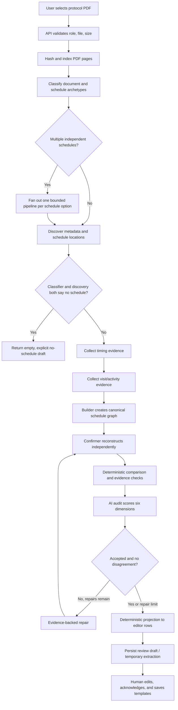

# Protocol PDF Extraction Pipeline — Technical Demo Notes

Last verified against the implementation: 2026-08-24

Verification performed for this note: 158 focused offline extraction,
projection, routing, provider-contract, and pattern-regression tests passed on
2026-08-24. Database-backed API tests are maintained separately because they
require a live MongoDB connection.

## 1. Executive explanation

My Trial Board converts a clinical-trial protocol PDF into two things:

1. trial metadata used to prefill Add Trial; and
2. a reviewable Schedule of Assessments represented as visit templates.

The important design choice is that the model does **not** directly create the
saved operational schedule. It first produces page-cited evidence and one rich,
canonical schedule graph. Server-side code validates that graph, independently
reconstructs the schedule a second time, compares both reconstructions, audits
the result against the PDF, optionally repairs it, and deterministically
projects the graph into the flat rows used by the mobile editor. Those rows are
still a draft. A sponsor/PI/CRO reviews and explicitly saves them.

The system is therefore best described as **AI-assisted extraction with
deterministic compilation and mandatory human review**, not autonomous clinical
decision-making.

## 2. Current demo configuration

The current `backend/.env` selects:

| Setting | Current value | Meaning |
|---|---|---|
| Provider | `gemini` | Google Gemini receives the PDF and returns structured output. |
| Builder model | `gemini-3.6-flash` | Used for classification, evidence collection, synthesis, audit, and repair. |
| Confirmation model | No separate override | Confirmation is a fresh reconstruction call using the same model. It is independent in context/output, but it is not a different model or vendor. |
| Maximum repair passes | `2` | At most two repair → reconfirm → reaudit loops. |
| Minimum acceptance threshold | `0.75` | Every applicable audit dimension must be marked passed and score at least 0.75. |

Do not claim “95% proven accuracy” during the demo. The code currently uses a
0.75 review threshold, and this threshold is based on model-reported audit
scores. It is a review-priority gate, not a measured clinical accuracy result.
The repository also states that real-PDF ground-truth evaluation is still
required before publishing an accuracy percentage.

## 3. User-visible workflow

### Add Trial path

1. The sponsor, CRO, or PI opens Add Trial.
2. The app first supports protocol-ID lookup. If no useful existing record is
   found, the user selects a PDF.
3. The frontend uploads it as multipart form data to `POST /api/protocols/extract`.
4. The request can take up to 30 minutes on the frontend because a long protocol
   may require multiple sequential model stages and multiple schedule variants.
5. The backend returns extracted trial metadata plus one or more temporary
   `extraction_id` values.
6. Metadata prefills the Add Trial form, but required fields are still validated
   before trial creation.
7. The backend stores each prepared schedule for two hours, scoped to the user.
8. After the trial is created, Visit Schedule calls
   `POST /api/trials/{trial_id}/protocol-extractions/{extraction_id}/consume`.
9. The schedule is reused without uploading the PDF or paying for a second AI
   extraction.
10. The user reviews flagged rows, edits/acknowledges them, and saves visit
    templates through the normal visit CRUD API.

### Existing Trial / Autofill path

1. The user opens the Visit Schedule editor for an existing trial.
2. The user selects a protocol PDF.
3. The frontend calls `POST /api/trials/{trial_id}/extract-schedule`.
4. The backend verifies trial ownership, extracts the schedule, persists an
   immutable canonical draft in `schedule_definitions`, and returns editor rows.
5. The extraction endpoint itself does not create operational visit templates.
   Saving in the editor performs that separate action.

### End-to-end flow



## 4. Input and access controls

### Who may extract

- Add Trial extraction: sponsor, CRO, or PI.
- Existing-trial extraction: sponsor, CRO, or PI who passes organization/PI
  ownership checks for that trial.
- A caller cannot use the endpoint to attach an extraction to a foreign trial.

### File validation

- Maximum PDF size: 25 MiB (`25 * 1024 * 1024`).
- Empty uploads are rejected.
- Add Trial accepts a PDF MIME type or `.pdf` filename.
- Existing-trial autofill accepts PDF, octet-stream, or blank MIME type and also
  checks that the content starts with `%PDF-`.
- Non-PDF, empty, and oversized uploads become clear 400/413 API errors before
  any model request.

### Temporary extraction security

- Prepared Add Trial schedules are stored in `protocol_extractions` for two
  hours.
- Consumption is scoped by `extraction_id`, current user ID, unexpired time,
  trial access, and existing trial linkage.
- An extraction already linked to a different trial returns a conflict.
- Expired/unavailable drafts require the PDF to be uploaded again.
- Extraction and consumption actions are written to the audit log.

## 5. Deterministic PDF indexing and retrieval

Before the graph runs, `protocol_document_index.py` builds a content-addressed
page index:

1. SHA-256 hashes the original PDF.
2. `pypdfium2` extracts embedded text once per physical PDF page.
3. Unicode and ligatures are normalized while line boundaries are retained for
   headings and tables.
4. Repeated boilerplate is detected across pages and removed from searchable
   text, except important schedule headings.
5. Every page receives:
   - a one-based physical page number;
   - stable page evidence ID;
   - text SHA-256;
   - character count;
   - section markers; and
   - `text`, `sparse_text`, or `image_or_empty` status.
6. Explicit weighted phrases score pages for five tasks: classification,
   schedule discovery, timing, activities, and review.
7. High-scoring pages seed the selection; adjacent pages are included because
   tables and footnotes often continue across page breaks.
8. Pages remain in original document order. The retriever never makes a
   clinical decision.

Current per-stage retrieval budgets are:

| Stage | Task profile | Maximum pages | Text budget |
|---|---:|---:|---:|
| Classification | classification | 14 | 45,000 characters |
| Discovery | schedule discovery | 24 | 80,000 characters |
| Timing | timing | 24 | 80,000 characters |
| Visit/activity evidence | activities | 24 | 80,000 characters |
| Synthesis/confirmation | review | 28 | 90,000 characters |
| Audit/repair | review | 24 | 80,000 characters |

Each rendered page begins with a citation similar to:

```text
[PDF page 42; evidence_id=page-42-<hash>; text_status=text]
```

The retrieved packet is a focus aid, not a hard boundary. With Gemini, the full
PDF remains available through native PDF input/context caching, so the model is
explicitly allowed to inspect omitted pages. If indexing fails, extraction
continues with the attached PDF. A page-index failure is never allowed to turn
a valid upload into a failed extraction.

If `PROTOCOL_PAGE_INDEX_CACHE_DIR` is configured, page indexes are stored by PDF
hash and schema version with atomic writes. It is not configured in the current
demo environment, so the index is rebuilt per upload.

## 6. Exact LangGraph extraction pipeline

### Stage 1 — Classification

Output: `DocumentTaskClassification`.

The classifier decides:

- document type: protocol, amendment, synopsis, schedule-only, reference,
  mixed bundle, or unrelated;
- task: full schedule, amendment comparison, table-only extraction, or no
  schedule;
- schedule archetypes;
- complexity;
- whether an attached reference/version comparison exists;
- protocol/version identifiers when stated; and
- whether the PDF contains multiple genuinely independent schedules.

“Independent schedules” means separate Schedule of Assessments tables for
different substudies/sub-protocols. It does not mean different arms sharing one
table.

### Multi-schedule routing

For a single schedule, the graph continues normally.

For multiple independent schedules:

1. the initial graph stops after classification to avoid merging incompatible
   timelines;
2. the shared classification and page index are reused;
3. one full graph is run for each option;
4. only that option's table/timing/activity evidence is allowed into its graph;
5. variants run with a bounded concurrency, currently defaulting to three; and
6. one failed option becomes an empty `needs_review` variant without destroying
   successfully extracted sibling variants.

The current frontend displays variants as separate collapsible cards and lets
the reviewer edit and save each selected schedule separately. Saved rows carry
a substudy label so the separation survives reload and enrollment.

### Stage 2 — Discovery

Output: `ScheduleDocumentMap`.

Discovery does not build visits. It finds:

- official title, registration/CTRI number, phase, indication, drug, duration,
  target enrollment, stated visit count, and status;
- all Schedule of Assessments/Activities/Events tables and flow charts;
- dosing, design, treatment, and follow-up prose that defines cadence;
- arms, cohorts, periods, washouts, extensions; and
- the baseline/randomization anchor.

Metadata and schedule extraction therefore share one analysis rather than
running unrelated Add Trial and schedule prompts in the Gemini path.

### No-schedule branch

The pipeline returns a correct empty result only when **both** classification
and discovery independently say there is no schedule. If only one says no, the
full extraction continues. This avoids discarding a schedule-only appendix that
one stage missed.

### Stage 3 — Timing evidence specialist

Output: `ScheduleTimingEvidence`.

This stage collects atomic, page-cited facts for:

- visit days, weeks, months, years, and hours;
- visit windows;
- cycle length, cycle count, and repetition ranges;
- relative timing;
- open-ended rules; and
- conflicts/unknowns.

Every fact has a unique evidence ID, claim, precise page/table/footnote location,
short source quote, and confidence. It does not construct the schedule.

### Stage 4 — Visit/activity evidence specialist

Output: `ScheduleVisitEvidence`.

This independently inventories:

- every visit column;
- screening, baseline, early termination, unscheduled, safety follow-up,
  telephone, and hourly visits;
- activities per column;
- conditional activities and table footnotes; and
- genuine arm/period differences.

Wide tables receive special treatment: every printed numeric column is a real
visit even when adjacent columns have identical activities. The stage is told
to count columns across all continuation pages rather than compressing them to
representative milestones.

### Stage 5 — Synthesis / builder

Output: `ExtractedSchedule` containing one `canonical_plan`.

The PDF is authoritative; the evidence packets guide and constrain synthesis.
The builder must author only the canonical graph and leave legacy flat visits
empty. The graph can preserve concepts that a flat spreadsheet cannot:

- anchors;
- phases;
- arms, cohorts, periods, and treatment sequences;
- events/visits;
- activities/procedures;
- recurrence rules;
- transitions and minimum/maximum gaps;
- conditional applicability;
- source conflicts; and
- evidence links on every populated object.

The builder must leave unsupported values unresolved rather than fill them with
common clinical defaults.

### Stage 6 — Independent confirmation

The confirmer receives the PDF, classification, document map, and evidence
packets, but it does not receive the builder's schedule. It reconstructs a
second canonical schedule independently.

Current demo nuance: this is a separate generation call, but because no
confirmation-model override is configured, it uses the same Gemini model as the
builder. Configuring `GEMINI_PROTOCOL_CONFIRMATION_MODEL` can route it to a
different Gemini model.

### Deterministic builder/confirmer comparison

Before trusting the AI audit, Python compares the two schedules:

- schedule kind, Day 0/Day 1 convention, and total cycles;
- flat projected visit signatures: name, type, day/range/hour timing, windows,
  relative timing, arm, period, and activities;
- every canonical collection: anchors, phases, branches, activities, events,
  recurrence, transitions, conditions, and conflicts; and
- semantic references rather than model-generated IDs, so two equivalent
  graphs with different internal IDs do not falsely disagree.

The comparison also checks both outputs against the visit-column inventory.
If the evidence specialist saw substantially more columns than either schedule
produced, verification is blocked even when builder and confirmer made the same
omission.

### Evidence-link validation

Python checks:

- duplicate and unknown evidence IDs;
- evidence category correctness (timing evidence must support timing, visit
  evidence must support names/activities, window evidence must support windows);
- below-threshold evidence confidence;
- missing evidence for populated fields; and
- evidence links across canonical anchors, phases, branches, events,
  activities, timing, windows, recurrence, transitions, conditions, and
  conflicts.

### Structural checks

Python flags, among other things:

- `schedule_kind=none` with visits, or a real kind with no visits;
- exact duplicate compiled visits;
- all dated visits collapsing to one day;
- recurring events whose first occurrence cannot be anchored;
- recurrence-generated names such as `Occurrence 2` where individually printed
  columns should have been used; and
- generic `visit_type="visit"` when a meaningful type should have been assigned.

### Stage 7 — Semantic audit

The auditor sees:

- expanded builder schedule;
- expanded confirmation schedule;
- deterministic disagreement list;
- original visit/activity evidence inventory; and
- the authoritative PDF.

It independently scores six dimensions:

1. visit coverage;
2. timing;
3. visit windows;
4. visit types;
5. procedure mapping; and
6. overall end-to-end schedule.

For acceptance:

- the audit must set `approved=true`;
- every applicable dimension must be marked passed;
- every applicable dimension must score at least the configured threshold;
- no critical or major issue may remain;
- builder/confirmer deterministic disagreements must be empty; and
- deterministic projection/validation must not require review.

One strong dimension cannot compensate for a weak one. For example, excellent
procedure mapping cannot hide an incomplete visit schedule.

### Stage 8 — Bounded repair loop

If the audit is not accepted or deterministic disagreements remain:

1. repair receives the full candidate, independent reconstruction,
   deterministic disagreements, audit findings, evidence inventory, and PDF;
2. it returns a complete replacement canonical schedule using the smallest
   evidence-supported corrections;
3. confirmation is rerun from scratch;
4. deterministic comparison is rerun;
5. audit is rerun; and
6. the process stops when accepted or after the configured maximum repairs.

With the current `max_refinements=2`, a single-schedule happy path uses seven
main model stages. A fully exercised repair path uses up to thirteen main stage
calls: seven initial calls plus two repair/confirm/audit rounds.

### Stage retries and checkpointing

- Each graph stage retries eligible extraction/network/timeout failures up to
  three times with exponential backoff.
- Gemini also retries malformed structured output once inside a provider call.
- Completed stages are stored in a JSON-compatible checkpoint map so an
  in-request/resumed graph can reuse them rather than repeat expensive upstream
  calls.
- In the current Gemini API request path, this checkpoint is in memory unless a
  caller explicitly persists and supplies it; it is not stored in MongoDB by
  the extraction endpoint.
- Ollama has separate durable per-PDF page-batch checkpoints on disk.

If confirmation, audit, or repair ultimately fails, the system retains the last
valid candidate and returns `needs_review`; it does not mark an unchecked draft
verified.

## 7. Canonical schedule schema

The canonical schema is version `2.0`.

| Object | Purpose |
|---|---|
| `SourceEvidence` | Atomic page/quote-backed fact and confidence. |
| `ScheduleAnchor` | Consent, randomization, first dose, period start, last dose, discharge, progression, etc. |
| `SchedulePhase` | Screening, run-in, treatment, washout, follow-up, extension. |
| `ScheduleBranch` | Arm, cohort, period, or randomized sequence. |
| `ScheduleEvent` | A real visit/timepoint, its timing, window, activities, branch, and type. |
| `ActivityTemplate` | Procedure/assessment with its own timing, tolerance, condition, and constraints. |
| `RecurrenceRule` | Protocol-declared repetition, including bounded or open-ended occurrence ranges. |
| `TransitionRule` | Same-day, before/after, washout, minimum-gap, or maximum-gap relationship. |
| `ScheduleCondition` | Conditional cycles, events, activities, or factorial-arm applicability. |
| `ScheduleConflict` | Contradictory protocol statements with explicit resolved/unresolved status. |

Timing is expressed as a typed object, not a single integer. Supported forms
include exact elapsed offset, calendar offset, range, relative, event-driven,
constraint, recurrence, and unresolved. A malformed timing shape is downgraded
to unresolved with its source wording retained, rather than crashing the entire
schedule or inventing missing numbers.

Visit windows separately record:

- visit versus activity scope;
- tolerance, validity, lookback, or gap meaning;
- stated, not stated, unclear, or conflicting state; and
- independent early and late amounts.

## 8. Deterministic schedule compilation

`expand_schedule()` is pure Python: the same input yields the same rows.

### Canonical precedence

If a canonical graph exists, it is the only source of truth. Any conflicting
model-authored flat rows are ignored. Flat-only legacy providers are converted
to a canonical fallback for backward compatibility.

### Day numbering

All operational rows use `day_offset=0` for the baseline anchor date while
preserving the exact printed label separately.

- Day 0 anchor: printed Day N maps to offset N.
- Day 1 anchor: positive Day N maps to N−1.
- Day 1 with explicit Day 0: non-positive labels use the continuous sequence.
- Day 1 with no Day 0: Day 0 is invalid; negative days remain prior-calendar
  offsets.
- If Day 0/Day 1 metadata is incomplete, ambiguous non-positive labels are not
  guessed and the row is flagged.
- Only exact `Day N` or exact `Day A–B` labels are automatically normalized.
  `Week 1` is not blindly converted to seven days.

If model arithmetic disagrees with a fully supported exact Day label, the
server corrects it deterministically and forces review; it cannot be called
verified solely because the correction was possible.

### Calendar timing

Month/year source units remain available as `calendar_offset_value/unit` so
patient-specific scheduling can apply real month lengths and leap years.
Compatibility rows may display an approximate 30-day-month/365-day-year offset,
but they include an explicit operational note that it is an approximation.
Exact patient scheduling uses calendar arithmetic and clamps dates such as
January 31 to the valid final day of February.

### Hours and PK timepoints

- Extracted Hour N values are absolute elapsed time unless explicitly stored as
  a within-day component.
- Hour 26 means exactly 26 elapsed hours; it is not Day 1 plus another 26 hours.
- Later crossover periods inherit their own period/dose anchor so identical
  “Hour 4” labels do not collapse onto Period 1.
- Procedure-level PK tolerance remains on the procedure; it does not become a
  visit window.

### Relative and event-driven timing

- Relative chains are resolved to a fixed point when anchors are known.
- Name matching is case/whitespace normalized and scoped by arm/period where
  possible.
- Circular, missing, or ambiguous anchors terminate safely and remain manual
  review items.
- Patient-specific triggers such as progression, last dose, or discharge remain
  undated until that event occurs.

### Recurrence

- Individually printed columns become individual events.
- A recurrence rule is used only when the protocol itself collapses repetition.
- Multiple recurrence rules preserve cadence changes.
- Open-ended recurrences remain open in the canonical graph. The editor shows a
  12-occurrence preview and explicitly flags that preview for review.
- A stated total cycle count is preferred when legacy repeating blocks are
  expanded.
- Conditional procedures can apply only to specified occurrences, such as
  imaging in cycles 2, 4, and 6.
- Final output is capped at 400 visits; truncation forces review.

### Projection and ordering

- Exact duplicates are removed using timing, arm, period, and label identity.
- Same-named visits in different arms/periods are not incorrectly merged.
- Rows sort chronologically; undated Early Termination/Unscheduled rows are
  preserved and sorted last.
- Crossover sequence names are folded into the flat arm field so same-numbered
  periods in different sequences remain distinguishable.
- Activities are routed into clinical versus administrative editor columns with
  wording and order preserved; unrecognized tasks default to clinical.

## 9. Schedule patterns and how each is handled

### Linear schedule

Every printed column is emitted in sequence, including screening, baseline,
treatment, follow-up, telephone, early termination, and unscheduled visits.

### Cyclic / oncology

Cycle templates and recurrence rules retain cycle length, first occurrence,
maximum count or open end, cadence changes, and occurrence-specific activities.
The server performs the date arithmetic.

### Crossover / bioavailability-bioequivalence

- One sequence branch per randomized treatment order.
- Period branches are nested under sequences.
- PK events attach to their own period's dose anchor.
- Washout is represented as a transition/minimum gap, not a fabricated visit.
- The design generalizes beyond 2×2 to three or more periods/sequences.

### Factorial

- One sibling arm branch per factor combination.
- The shared visit timeline is authored once.
- Factor-specific activities use branch-scoped conditions rather than leaking
  into all arms or duplicating the entire timeline.

### Multi-arm

Shared visits are authored once. Events are duplicated by arm only when timing,
windows, or activities genuinely differ.

### Multi-phase / extension

Screening, run-in, treatment, follow-up, and extension remain separate phases.
An extension keeps its own anchor/cadence unless the protocol explicitly
continues core-study numbering.

### Intra-day

Minute/hour timepoints and ranges are preserved. Each repeated period uses its
own dosing anchor. Activity tolerances do not overwrite visit tolerances.

### Event-driven

Surgery, last dose, discharge, progression, end of treatment, and similar
events are explicit anchors. A numeric offset is calculated only when the
protocol states one.

### Amendment / mixed bundle

Version identifiers and source locations are retained. Conflicting old/new
values become explicit canonical conflicts unless the governing version is
clear. Unresolved lineage conflicts block verification.

### Synopsis

Only printed facts are extracted. Missing schedule detail is recorded as an
assumption rather than completed from a “typical” protocol.

### Schedule-only PDF

The table header and every footnote become especially important because dosing
prose may be absent. Missing cadence/window facts remain unresolved.

### Unrelated or no-schedule document

When both classification and discovery agree, the correct output is
`schedule_kind=none`, zero visits, and an explicit explanation. The system does
not manufacture a plausible schedule.

## 10. Special timing/window cases

- Negative screening days remain before baseline.
- Exact day ranges preserve both start and end.
- A bounded statement such as “within 28 days before randomization” is not
  presented as a confirmed Day −28 appointment; it remains a reviewable bound.
- Symmetric `±N` and asymmetric early/late windows remain distinct.
- A missing window remains null; there is no default `±3 days`.
- “A window exists” without a magnitude becomes `unclear`, not a made-up number.
- Per-visit window widening, such as ±3 then ±5 then ±7, is retained per row.
- Procedure prose such as “pre-dose,” “as clinically indicated,” and “prior to
  discharge” stays unresolved when it has no numeric amount/anchor.
- Conditional visits and activities remain visible with their conditions.
- Same-day merge and lab-gated dose-delay rules remain constraints rather than
  becoming extra invented visits.

## 11. Verification result shown to the user

The API returns:

- `status`: `verified`, `needs_review`, or `not_run`;
- audit confidence;
- refinement count;
- issues;
- per-dimension accuracy scores; and
- independent confirmation score.

The frontend shows:

- “AI Extracted”;
- “Agent verified” only for `verified`;
- number of rows requiring review;
- All / Pending / OK filters; and
- expandable reasons explaining why fields were flagged.

“Agent verified” still means **verified by this automated pipeline as a draft**.
The UI explicitly states that human review is required before saving.

Rows are marked pending when, for example:

- global extraction verification needs review;
- deterministic normalization produced a warning;
- timing is not calculable;
- a timing statement is only a boundary/approximation;
- a window is unclear/conflicting; or
- an open-ended recurrence was previewed.

The reviewer can edit, delete, reorder, add, or explicitly acknowledge a row.
If pending rows remain, Save shows an additional confirmation step. The backend
also re-flags an undated row unless it was explicitly acknowledged, preventing
a client from silently turning unknown timing into baseline.

## 12. Persistence model

### `protocol_extractions`

Short-lived Add Trial handoff records containing details, serialized schedule,
option metadata, user ID, timestamps, and two-hour expiry.

### `schedule_definitions`

Immutable AI draft records containing:

- schema version;
- `draft_review` status;
- classification;
- canonical plan;
- evidence facts;
- canonical validation issues;
- compatibility visits;
- verification metadata; and
- source extraction/user metadata.

Persistence is idempotent for the same source extraction ID. Creating a draft
does not replace an approved operational schedule.

### `visits`

Operational visit templates created only when the reviewer saves the editor.
These contain flat timing fields, clinical/admin tasks, structured procedures,
constraints, evidence links, extraction/review state, and optional arm/period/
substudy labels.

When templates are later changed, future pending patient instances are
rematerialized and relative templates are recalculated. Historical completed or
past instances are protected by the normal scheduling workflow.

## 13. Provider behavior

### Gemini — current production/demo path

- Native PDF input and Pydantic-backed structured JSON output.
- Temperature 0.1 and minimal thinking budget to reduce JSON truncation.
- Uses a compact provider schema that excludes server-owned verification
  fields.
- Malformed/empty/truncated structured output receives one immediate retry.
- For PDFs of at least 100 KB, attempts a Gemini context cache so the PDF is
  uploaded once and referenced by the 7–13 stage calls.
- Default cache TTL is 30 minutes.
- Cache creation/use failure falls back to attaching the full PDF per call and
  never fails extraction by itself.
- Cache deletion is best-effort at the end of extraction.

### Claude — legacy fallback

- Native PDF document block with ephemeral provider caching.
- Single-shot schedule extraction, not the decomposed classification graph.
- JSON is locally validated with Pydantic; invalid JSON gets one correction
  request.
- Does not detect/fan out multiple independent schedules in the legacy path.

### OpenRouter — legacy fallback

- Sends the PDF as a data URL with strict JSON-schema output.
- Optional configured PDF parsing engine.
- Temperature zero.
- Single-shot schedule extraction; no decomposed multi-option detection.

### Ollama/Qwen-VL — local/offline fallback

- PDF never goes to a third-party AI provider.
- Pages render locally to JPEG in two-page batches by default.
- Each batch is processed sequentially and checkpointed to JSONL by PDF hash.
- Interrupted large-PDF extraction resumes from complete batches.
- Evidence is recursively reduced if it exceeds 48,000 characters.
- Final structured result is atomically cached on disk.
- Missing model or stopped Ollama produces a configuration-specific error.
- This is also a legacy single-shot path and does not currently fan out
  independent schedules.

## 14. Failure behavior

| Failure | Behavior |
|---|---|
| Provider key missing/rejected | HTTP 503, extraction not configured. |
| Provider billing/quota exhausted | HTTP 503, provider unavailable; document is not blamed. |
| Rate limit/overload | HTTP 503 with retry-later guidance. |
| Provider/parse failure | HTTP 502 after bounded retries. |
| Page indexing/retrieval failure | Logged; full-PDF extraction continues. |
| Scanned/image page | Flagged as requiring vision/OCR; Gemini still has the native PDF. |
| Malformed stage output | Retry only that stage; completed upstream stages remain reusable. |
| Confirmation failure | Keep candidate, force `needs_review`. |
| Audit failure | Return unchecked review draft; never mark verified. |
| Repair failure | Keep last valid candidate and force review. |
| Repair limit reached | Return `needs_review` with unresolved issues. |
| One multi-schedule option fails | Return empty flagged option; keep successful siblings. |
| Unknown/conflicting fact | Preserve source wording/conflict; leave unresolved. |
| Open-ended recurrence | Keep canonical recurrence open; preview 12 occurrences and flag. |
| More than 400 projected visits | Keep first 400 and flag cycle count for review. |
| Prepared extraction expired | HTTP 404; upload PDF again. |

## 15. Privacy and operational boundaries

- Protocols may contain confidential clinical and sponsor information.
- In the current Gemini mode, the PDF is sent to Google Gemini.
- The optional Gemini context cache is deleted best-effort when extraction
  finishes; provider-side retention is still governed by the provider account
  and contract.
- Optional page-index caches contain extracted protocol text and must use a
  private directory with the same retention policy as the source document.
- Ollama keeps processing local but stores page evidence/results in its local
  extraction cache.
- Structured failure logs deliberately report finish reason, response size,
  and failing schema fields without logging protocol page content.
- Extraction outputs are drafts; this pipeline is not a substitute for sponsor,
  medical, biostatistical, or site review.

## 16. Demonstration script

### Suggested 8–10 minute live demo

1. **Set the context:** “The challenge is not reading one table. Clinical
   protocols scatter timing, cycle length, footnotes, and conditions across
   different pages.”
2. **Show Add Trial:** enter/lookup a protocol ID, then choose PDF upload.
3. **Point out one analysis:** metadata and schedule come from the same Gemini
   workflow; the schedule is cached for two hours so the next screen does not
   rerun AI.
4. **While extraction runs, explain the seven-stage happy path:** classify,
   discover, timing evidence, visit evidence, build, confirm, audit.
5. **Show the Visit Schedule screen:** visit count, exact protocol labels,
   offsets/windows, clinical/admin tasks, constraints, and the verified/review
   badge.
6. **Open “why fields were flagged”:** emphasize that uncertainty is surfaced,
   not hidden.
7. **Filter Pending:** edit or acknowledge one row. Explain that unknown timing
   is never silently converted to baseline.
8. **If using a cyclic protocol:** show how a collapsed “Cycle 2 and next
   cycles” source becomes deterministic per-cycle rows and how conditional
   imaging appears only on stated cycles.
9. **Save:** explain that this is the human approval boundary where visit
   templates become operational.
10. **Close with auditability:** canonical schedule, evidence facts,
    verification result, source extraction ID, and audit events are retained.

### Strong opening example

Use the PICN-style problem:

> “The appendix may print nine columns, but the actual schedule can be roughly
> 25 visits. The cycle length is on one page, the repetition rule on another,
> and cycle-specific imaging in several sections. A table-only OCR solution can
> be wrong while looking plausible. This pipeline separates evidence gathering,
> schedule construction, deterministic arithmetic, and independent review.”

## 17. Likely technical questions and answers

### “Is this just one prompt?”

No. Gemini follows a bounded LangGraph workflow with specialized
classification, discovery, timing, activity, synthesis, independent
confirmation, audit, and optional repair stages.

### “Why not ask the model for final rows?”

Because models are poor places to hide cross-page schedule arithmetic. The
model declares protocol structure; Python expands and validates it repeatably.

### “How do you prevent hallucinated windows?”

Missing windows have an explicit `not_stated` state, every populated window
requires window-category evidence, builder/confirmer outputs are compared, and
the audit scores windows independently. No default tolerance is injected.

### “What makes confirmation independent?”

The confirmer reconstructs from the PDF and evidence without seeing the
builder output. In the current environment it is a separate call to the same
model; a different confirmation model can be configured. The subsequent
comparison is deterministic Python.

### “Can two models make the same mistake?”

Yes. That is why the system also compares visit counts to the independently
collected column inventory, validates evidence links/categories, performs
structural checks, and still requires a human review. This reduces risk; it
does not mathematically eliminate it.

### “What does verified mean?”

It means the automated draft passed all configured audit dimensions,
builder/confirmer comparison, evidence checks, and deterministic validation.
It does not mean regulatory approval or proven ground-truth accuracy.

### “How are scans handled?”

The text index marks pages without usable embedded text. Gemini still receives
the native PDF for multimodal reading. The local Ollama path explicitly renders
pages to images. Heavily degraded scans remain a known human-review risk.

### “What happens when the protocol says until progression?”

The canonical recurrence remains open. The editor previews 12 occurrences and
flags the schedule so a reviewer can set an operational horizon without the
system pretending the protocol specified one.

### “How are amendments handled?”

Classification switches the task to version comparison. Facts retain version
and source locations; unresolved old/new conflicts are explicit and block
verification.

### “How do multiple substudies work?”

They are classified as independent schedule options, extracted in separate
bounded pipelines, displayed as separate cards, saved with substudy labels, and
never silently merged.

### “Does extraction immediately schedule patients?”

No. It creates a draft. Only reviewed/saved visit templates enter the normal
patient scheduling workflow.

### “Is the reported 0.75 score a measured accuracy?”

No. It is the current model-audit acceptance threshold. Measured accuracy needs
a manually labeled real-PDF evaluation set and must be reported separately.

## 18. Known limitations and honest disclosures

1. Real-PDF ground-truth accuracy across the supplied corpus has not yet been
   established for the current design.
2. Builder and confirmer currently use the same model unless a separate Gemini
   confirmation model is configured.
3. Model-reported audit scores are not calibrated clinical accuracy estimates.
4. Heavily degraded scans or unusually structured tables can still require
   manual reconstruction.
5. Claude, OpenRouter, and Ollama paths are legacy single-shot providers and do
   not provide the same decomposed multi-schedule workflow as Gemini.
6. Add Trial validates PDF MIME/name but does not currently perform the `%PDF-`
   magic-byte check used by the existing-trial extraction route.
7. The graph checkpoint mechanism is not durably persisted by the current
   Gemini API endpoint; an application process restart can lose in-flight stage
   progress. Ollama page-batch checkpoints are durable.
8. The frontend permits a reviewer to confirm-save with pending rows; this is a
   deliberate human override, not a claim that every flag was resolved.

## 19. Implementation map

| Component | File |
|---|---|
| API upload, temporary handoff, draft persistence, editor payload | `backend/server.py` |
| Provider selection, Gemini/Claude/OpenRouter/Ollama, deterministic expansion | `backend/protocol_extraction.py` |
| LangGraph stages, prompts, confirmation, audit, repair, retries | `backend/protocol_agent.py` |
| PDF hashing, page text index, retrieval and page citations | `backend/protocol_document_index.py` |
| Canonical v2 schema, validation, temporal/calendar math, row projection | `backend/schedule_schema.py` |
| Add Trial upload and metadata prefill | `frontend/app/(app)/sponsor/add-trial.tsx` |
| Schedule consumption, variants, review UI, saving | `frontend/app/(app)/sponsor/visit-schedule.tsx` |
| Timing display/calculation helpers | `frontend/src/lib/visit-timing.ts` |

## 20. Test coverage map

The repository contains focused tests for:

- page-index stability, scanned-page reporting, task retrieval, adjacent
  footnotes, budgets, caching, corrupt cache recovery, and invalid PDFs;
- no-schedule routing, classification guidance, retrieval fallback, mismatched
  PDF index rejection, and multi-schedule selection/fan-out;
- repair and reaudit, bounded failure, unavailable confirmation/audit/repair,
  per-dimension gating, same-error builder/confirmer protection, evidence
  confidence/categories, and checkpoint resume;
- Day 0/Day 1 arithmetic, negative screening, ranges, Hour 26, cyclic expansion,
  cadence changes, conditional procedures, relative chains/cycles, duplicate
  handling, chronological sorting, and runaway caps;
- canonical calendar timing, leap years, event-driven visits, asymmetric
  windows, open recurrence, conflicts, canonical precedence, and procedure
  versus visit windows;
- 2×2 and three-way crossover, factorial arms, multi-arm, event-driven,
  intra-day, calendar follow-up, conditional visits, bounded screening,
  window widening, ET/unscheduled, daily diary, independent cadences,
  amendment lineage, timing downgrades, unit normalization, and task routing;
- API draft persistence, idempotency, canonical retrieval, operational
  constraint round trips, Add Trial handoff, and schedule editor contracts.

The most relevant test modules are:

```text
backend/tests/test_protocol_agent.py
backend/tests/test_protocol_agent_routing.py
backend/tests/test_protocol_document_index.py
backend/tests/test_protocol_expansion.py
backend/tests/test_protocol_json_response.py
backend/tests/test_protocol_pattern_regressions.py
backend/tests/test_protocol_timing_contract.py
backend/tests/test_schedule_schema_v2.py
backend/tests/test_schedule_selection.py
backend/tests/test_schedule_definition_api.py
backend/tests/test_protocol_creation.py
```

## 21. One-minute closing summary

> “The application does not treat protocol extraction as PDF-to-JSON in one
> shot. It first identifies the document and schedule type, retrieves relevant
> pages, extracts atomic timing and visit evidence, builds one canonical
> evidence-backed graph, independently reconstructs it, compares both outputs
> with deterministic code, audits six accuracy dimensions, repairs within a
> strict bound, and compiles the result into mobile-friendly visits. Unknowns,
> conflicts, open-ended schedules, and provider failures fail toward human
> review. Only after a user reviews and saves does the draft become an
> operational visit template.”
